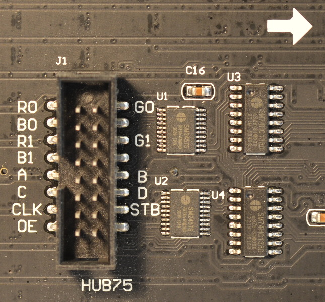

# AudioVisualizer
Get Pi running in headless mode:

    https://www.windowscentral.com/how-set-headless-raspberry-pi-windows-10

In boot/config.txt

    dtparam=audio=on -> dtparam=audio=off (not optional)
    remove dtoverlay=w1-gpio (if it exists)

Performance:

    sudo raspi-config
    System Options -> Boot / Auto Login -> Console Autologin

Dependencies:

    sudo pip3 install numpy
    sudo pip3 install scipy
    ('sudo apt-get install gfortran libopenblas-dev liblapack-dev' first if you can't install scipy)
	
    sudo apt-get remove libportaudio2
    sudo apt-get install libasound2-dev
    git clone -b alsapatch https://github.com/gglockner/portaudio
    cd portaudio
    ./configure && make
    sudo make install
    sudo ldconfig
    cd ..
	
    sudo pip3 istall pyaudio

rpi-rgb-led-matrix Library

    git clone https://github.com/hzeller/rpi-rgb-led-matrix
    cd rpi-rgb-led-matrix
    make
    cd ..

Connecting Matrix to Pi:

|Connection                        | Pin | Pin |  Connection
|---------------------------------:|:---:|:---:|:-----------------------------
|                             -    |   1 |   2 | -
| **STB** | 4|5| -
|             - |   5 |   6 |**GND**
|**B1** |   7 |   8 | **R2**
|                              **G2**   |   9 |  10 | **B2**
|**R1**  |  11 |  12 | -
|              -|  13 |  14 | -
|-|  15 |  16 | -
|                             **CLK**    |  17 |  18 | **OE**
|               - |  19 |  20 | -
|              - |  21 |  22 |**A**
|               **B**|  23 |  24 | **C**
|                             -    |  25 |  26 | -
|                             **G1**    |  27 |  28 | -
|              - |  29 |  30 | -
|              - |  31 |  32 | -
|              -|  33 |  34 | -
|              - |  35 |  36 | -
|              - |  37 |  38 | -
|                              -   |  39 |  40 | - |

Running:

    sudo python3 audio_visualizer.py
